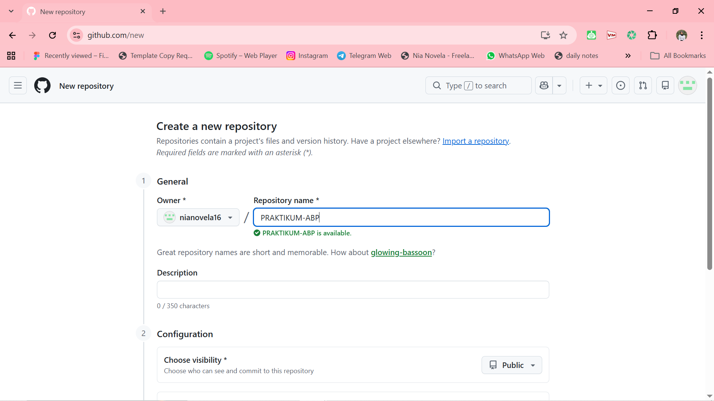
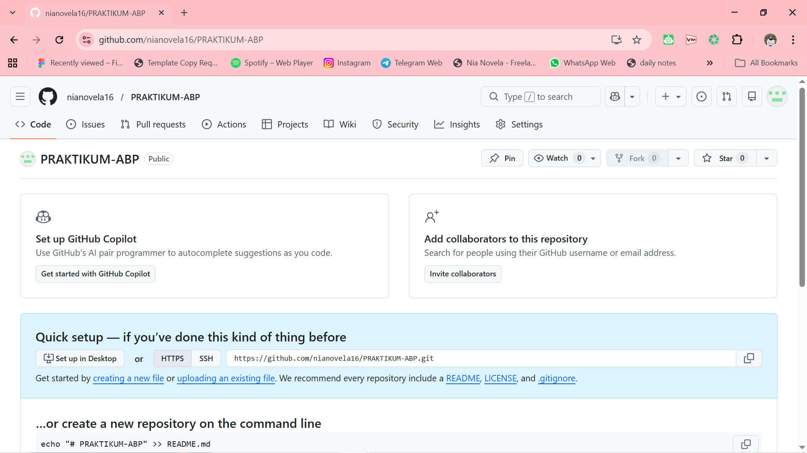
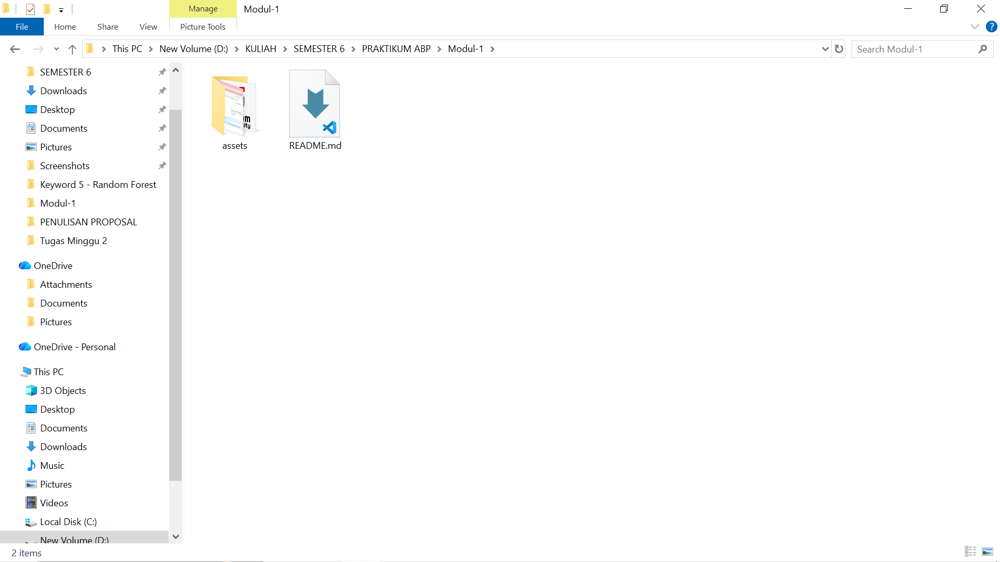

   
  <h1>LAPORAN PRAKTIKUM  APLIKASI BERBASIS PLATFORM</h1>
   
  <h3>MODUL 1   GIT</h3>
   
   
   
   
   
  <h3>Disusun Oleh :</h3>
  

    <strong>Nia Novela Ariandini</strong> 
    <strong>2311102057</strong> 
    <strong>S1 IF-11-01</strong>
  

   
  <h3>Dosen Pengampu :</h3>
  

    <strong>Dimas Fanny Hebrasianto Permadi, S.ST., M.Kom</strong>
  

   
   
    <h4>Asisten Praktikum :</h4>
    <strong> Apri Pandu Wicaksono </strong>  
    <strong>Rangga Pradarrell Fathi</strong>
   
   
   
   
  <h3>LABORATORIUM HIGH PERFORMANCE
  FAKULTAS INFORMATIKA  UNIVERSITAS TELKOM PURWOKERTO  2026</h3>

---

## 1. Dasar Teori

**Git** merupakan sistem pengontrol versi (*Version Control System*) yang sering digunakan oleh developer untuk mencatat perubahan pada file atau kode program. Dengan Git, kita bisa melihat riwayat perubahan, mengelola versi kode, serta mempermudah kerja kolaborasi dengan developer lain dalam satu proyek.

Sementara itu, **GitHub** adalah platform berbasis web yang berfungsi sebagai tempat penyimpanan repositori Git secara online. Melalui GitHub, proyek dapat disimpan di internet sehingga lebih mudah diakses, dibagikan, dan dikelola bersama.

**Command Line Interface (CLI)** adalah antarmuka berbasis teks yang memungkinkan pengguna menjalankan perintah secara langsung melalui terminal atau command prompt. Pada praktikum ini, CLI digunakan untuk menjalankan berbagai perintah Git karena prosesnya lebih cepat dan lebih fleksibel dibandingkan menggunakan antarmuka grafis.

---

## 2. Setup Repository via CLI

Berikut merupakan langkah-langkah yang dilakukan untuk melakukan setup repository dari komputer lokal ke GitHub menggunakan CLI.

### Langkah 1 : Membuat Repository Baru di GitHub

Langkah pertama yang dilakukan adalah membuat repository baru di GitHub. Repository ini nantinya digunakan sebagai tempat penyimpanan proyek secara online. Dengan adanya repository tersebut, file atau kode yang dibuat di komputer lokal bisa disimpan di GitHub sehingga lebih aman dan mudah diakses kembali.

### Langkah 2 : Melihat Panduan Perintah Git

Setelah repository berhasil dibuat, GitHub biasanya akan menampilkan beberapa contoh perintah Git yang bisa digunakan. Perintah tersebut berfungsi untuk menghubungkan proyek yang ada di komputer lokal dengan repository yang sudah dibuat di GitHub.

### Langkah 3 : Membuat Folder Proyek dan File

Pada tahap ini dibuat sebuah folder proyek di komputer lokal. Folder tersebut nantinya akan berisi file atau kode yang ingin disimpan di GitHub. File yang ada di dalam folder inilah yang nantinya akan di-*upload* ke repository.

### Langkah 4 : Membuka CMD dari Folder Proyek

Selanjutnya membuka Command Prompt (CMD) atau Terminal pada direktori folder proyek yang sudah dibuat. Hal ini dilakukan agar perintah Git yang dijalankan nantinya langsung diterapkan pada folder proyek tersebut.

### Langkah 5 : Menjalankan Perintah Git di Terminal (Push ke GitHub)

Pada tahap ini dijalankan beberapa perintah Git di terminal. Proses dimulai dengan melakukan inisialisasi repository menggunakan `git init`, kemudian menambahkan file dengan `git add`, membuat commit menggunakan `git commit`, menghubungkan repository lokal dengan GitHub menggunakan `remote`, dan terakhir mengunggah file ke GitHub menggunakan perintah `git push`.

### Langkah 6 : Repository Berhasil Diperbarui

Tahap terakhir adalah mengecek repository di GitHub untuk memastikan apakah file yang tadi di-*push* dari komputer lokal sudah berhasil muncul di repository tersebut.

## Refrensi
- [Materi Modul 1](https://drive.google.com/file/d/1sAJR4AconN_aZjvLF-GTY0DM-e84pL63/view?usp=sharing)